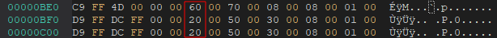

# [NDS] Castlevania - Dawn of Sorrow - Credit Edit tool

Ferramenta criada por denim para editar os créditos finais do jogo.

## Parte técnica

Os créditos do jogo estão em um formato horrível de editar, com várias letras se repetindo em diversos lugares, tornando impossível de editar com editores de tiles comuns. Foi necessário fazer isso de forma programática, para garantir uma edição apropriada e otimizada o bastante para comportar na rom.

Os créditos do jogo estão situados nos seguintes arquivos, dentro da rom:

- sc
  - f_roll0.dat
  - f_roll1.dat
  - f_roll2.dat
  - f_roll3.dat
  - f_roll4.dat
  - f_roll5.dat
  - f_roll6.dat
  - f_roll7.dat
  - f_roll8.dat
- so
  - p_roll.dat

Os arquivos "f_roll" da pasta "sc" contém apenas os tiles - letras, caveiras e outros símbolos utilizados na rolagem dos créditos. Já o arquivo "p_roll.dat" da pasta "so" é o que contém as chamadas "primitivas" - valores de memória que representam palavras ou partes de palavras.

Essa ferramenta funciona basicamente assim:

- Lê os conteúdos do arquivo "creditos.txt".
- Lê as imagens dos arquivos BMP contendo os sprites.
- Lê os metadados dos arquivos "fonte-cdos1.txt" e "fonte-cdos2.txt".
- Gera 9 arquivos "f_roll" (de 0 a 8).
- Gera o arquivo "p_roll.dat" com as primitivas atualizadas.

Uma vez com os arquivos gerados em mãos, é só adicionar eles dentro da rom nas pastas "sc" e "so", que devem surtir efeito.

# Como a tool funciona

Para utilizar a ferramenta, basta rodar o seguinte comando dentro dessa pasta:
```bat
cdosCreditEdit.exe -insert -i "creditos.txt" -o "p_roll.dat"
```

Ou alternativamente executar o arquivo "run-insert.cmd".

Assumindo que os arquivos de texto contenham as mudanças esperadas e não estejam com uma sintaxe inválida, a ferramenta deve gerar os arquivos modificados na mesma pasta da ferramenta.

# Bugs menores

Q: Os tiles das caveiras e do "THE END" estão com alguns píxels pretos ou transparentes.

A: A paleta que a ferramenta utiliza para inserir os gráficos é a padrão do Tile Molester e possui uma cor duplicada, causando esse problema menor. É possível que seja corrigido no futuro, mas nada garantido. Como workaround, recomendo corrigir os píxels manualmente após gerar os arquivos f_roll, usando o Tile Molester. Os créditos estão em formato 4bpp linear reverso, em modo de 2 dimensões, e você pode utilizar a paleta do arquivo "creditos.pal" para facilitar as edições.

Q: Incluí alguns nomes, mas percebi que, na tela do "THE END", o copyright do fundo não apareceu.

A: A ferramenta tenta fazer um cálculo automático das posições das primitivas relacionadas ao "THE END" e ao copyright, mas isso pode não estar funcionando corretamente. Caso queira tentar contornar isso manualmente, você pode abrir o arquivo p_roll.dat num editor hexadecimal, ir nos offset 0x0BE6 / 0x0BF6 / 0x0C06, e incrementar ou decrementar seus valores em 10, até surtir o efeito esperado. A imagem abaixo pode servir como guia.



Q: Percebi que, no arquivo "creditos.txt" traduzido, vários nomes tiveram de ser abreviados. Por que não mantê-los sem abreviação, como no original?

A: Muito embora haja bastante espaços nos tiles dos arquivos "f_roll", que teoricamente daria pra comportar nomes desabreviados, o gargalo está no arquivo "p_roll.dat" que contém as primitivas, onde basicamente há um limite de quantas primitivas o arquivo pode comportar. Se a quantidade de palavras (ou partes de palavras) ultrapassarem um determinado limite, o arquivo "p_roll.dat" poderá ultrapassar seu tamanho de 4kb, assim causando diversos bugs ingame durante a rolagem de créditos.

# Disclaimer

Embora esta ferramenta esteja aqui disponibilizada, ela foi fornecida as-is. O código-fonte dela não está disponível, e nenhum suporte será dado. Use-a por sua conta e risco.